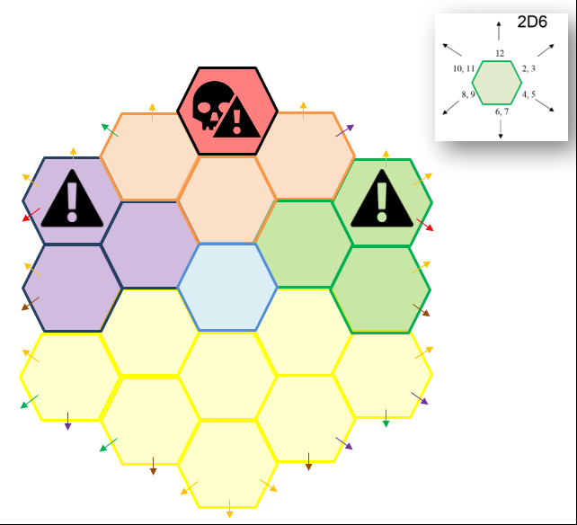

# 🧭 Sistema de Exploração pelos Ermos

## 1. Definir as Funções de Cada Jogador

### 🥾 Batedor
Responsável por avançar à frente do grupo e identificar ameaças.

- **Ação:** Teste de **SAB** ou **AGI** contra a CD do ambiente a cada HEX.
- **Sucesso:** Nota ameaças antes delas perceberem o grupo.
- **Ausência:** Não é possível emboscar ou evitar ameaças.
- **Opcional:** Rolar dado de encontro progressivo  
  `1d10 → 1d8 → 1d6 → 1d4`  
  Ao tirar **1**, ocorre encontro e o dado reinicia.

---

### 🌿 Caçador ou Coletor
Garante alimento e água durante a jornada.

- **Ação:** Teste de **SAB** contra CD do ambiente.
- **Sucesso:** Garante recursos de um personagem para 1 dia.
- **Falha:** Role `1d6`. Em um resultado 1–3 ocorre uma consequência, em 4–5 um evento e com 6 nada acontece.
- **Ausência:** Consumo apenas de recursos próprios.

---

### 🗺️ Cartógrafo
Registra o mapa da região.

- **Ação:** Teste de **INT** contra CD do ambiente.
- **Sucesso:** O HEX é cartografado. Testes realizados em HEXs cartografados são feitos com vantagem. Para facilitar a visualização do mapa, marque deslocamentos por HEXs não cartografados com linhas tracejadas e deslocamentos por HEXs cartografados com linhas contínuas.
- **Extra:** Rolar `1d6` independente de Sucesso ou Falha sendo:
  - 1–3: Nada acontece
  - 4: Avistamento
  - 5: Vestígios
  - 6: Marcos
  
  Fique livre para usar uma tabela ou definir puramente com improviso os avistamentos, vestígios e marcos notados pelo Cartógrafo.
- **Ausência:** Sem bônus por exploração prévia.

---

### 🧭 Navegador
Define o caminho do grupo.

- **Ação:** Teste de **SAB** ou **INT**
- **Sucesso:** Segue caminho ideal para o próximo HEX
- **Falha:** Rolar `1d3` usando o *Oraculo do Navegador*:
  - 1: Melhor caminho para o próximo HEX
  - 2: Esquerda do melhor caminho
  - 3: Direita do melhor caminho
- **Quando tiver 2 falhas sequênciais:**
  1. Continuar a navegar → Usar `1d6` para determinar as direções com *Oraculo do Navegador*
  2. Tentar se orientar → permanece no HEX por um período e rola-se dado de encontro 2x
- **Ausência:** Navegação aleatória (`1d6`) com o *Oraculo do Navegador*

---

### 🤝 Suporte
Auxilia outros membros.

- **Ação:** Concede vantagem a outro personagem.
- **Ausência:** Sem suporte adicional.

---

## 2. Definir Caminhos Possíveis
Estabeleça rotas entre origem e destino.

---

## 3. Definir Tipo de Terreno

### 🌍 Tabela de Terreno

| d8 | Tipo      | CD | Característica         |
|----|----------|----|------------------------|
| 1  | Deserto  | 13 | Baixa visibilidade     |
| 2  | Planície | 10 | Abundante              |
| 3  | Pântano  | 13 | Água poluída           |
| 4  | Colina   | 10 | -                      |
| 5  | Floresta | 12 | -                      |
| 6  | Montanha | 12 | Altitude elevada       |
| 7  | Tundra   | 11 | -                      |
| 8  | Geleira  | 14 | Tempestade de neve     |

---

### ⚠️ Características Extras (1d12)

1. Abundante → Sucesso automático em teste de Caçador ou Coletor
2. Altitude Elevada → desvantagem em todos os testes de funções
3. Magia Caótica → Toda tentativa de magia pode gerar uma consequência, mesmo que apenas narrativa
4. Água Poluída → envenenamento se beber a água
5. Baixa Visibilidade → +2 CD em testes de todas as funções
6. Caminho Confuso → +2 CD em testes do Navegador  
7. Campo de Batalha → chance de encontro extra
8. Estrada de Mercadores → Role `1d6`, para 1-3 encontra caravana de viajantes, 4-6 encontra mercadores
9. Gases Venenosos → `1d4` dano por HEX
10. Suga-vida → cura (por itens ou magia) ou recuperação durante descanso é reduzida (fique livre pra determinar a taxa de redução)
11. Terreno Acidentado → `1d4` dano por falha nos testes de todas as funções
12. Terreno Infértil → +3 CD nos testes do Caçador ou Coletor

---

## 4. Deslocamento diário X Sobrecarga

| Tipo                  | Leve | Médio | Alto | Extremo |
|----------------------|------|------|------|--------|
| Lento e cuidadoso*   | 15 km | 10 km | 5 km | 2,5 km |
| A pé                 | 25 km | 20 km | 15 km | 5 km |
| Montaria             | 35 km | 30 km | 20 km | 10 km*** |
| Galopando**          | 70 km | 50 km | 30 km | 10 km*** |

- *Vantagem em testes de todas as funções
- **Desvantagem em testes de todas as funções
- ***Role `1d6` a cada HEX, caso tire 1-2 a montaria desmaia

---

## 5. Tempo Médio da Viagem
Baseado nos passos 2 e 4.

---

## 6. Hora de Partida (Opcional)
Rolar `1d12`.

---

## 7. Clima (Flor do Tempo)

A partir do HEX `azul` na Flor do Tempo (ponto de partida), defina o tipo de região (neutra, desértica ou gélida) e role `2d6` para determinar o clima conforme a tabela.

| Cor      | Região Neutra              | Região Desértica                          | Região Gélida              |
|----------|----------------------------|-------------------------------------------|----------------------------|
| Azul     | Ponto de partida (neutro)  | Ponto de partida (neutro)                 | Ponto de partida (neutro)  |
| Amarelo  | Sol entre núvens           | Calor suportável                          | Frio moderado              |
| Roxo     | Chuvoso ou Tempestade(!)   | Calor intenso ou Inferno na Terra(!)      | Frio ou Frio intenso(!)    |
| Verde    | Calor ou Calor Intenso(!)  | Noite fria ou Noite fria Intensa(!)       | Nevando ou Nevasca(!)      |
| Laranja  | Tempestade com ventania    | Tempestade de areia                       | Tempestade de gelo         |
| Vermelho | Furacão                    | Chuva de fogo                             | Avalanche                  |

> Fique livre para determinar o que ocorre com o grupo a cada tipo de clima.
---

## 8. Realize os testes de funções do grupo por HEX na seguinte ordem:

1. Navegador  
2. Cartógrafo  
3. Batedor  
4. Caçador/Coletor  

⚠️ A função de Suporte pode ser testada a qualquer momento que for necessário

---

## 9. Acampamento

### 👁️ Vigia
Função apenas em acampamentos.
- Quem está de vigia recupera apenas `1d3` de vida
- O restante do grupo recupera `1d6` de vida
- **Ação:** Teste de SAB ou INT para notar perigos
- **Falha:** Grupo pode ser surpreendido

### 🍖 Consumir suprimentos
Cada jogador deve consumir sua porção diária de suprimentos.
O jogador que não se alimentar no acampamento terá a seguinte penalidade por dia:
- 1º dia → recupera metade dos PV no descanso e sofre +1 CD em todos os testes.

- 2º dia consecutivo → não recupera PV no descanso e sofre +2 CD em todos os testes.

- 3º dia consecutivo → não recupera PV no descanso e desvantagem em todos os testes.

- 4º dia consecutivo → o personagem desmaia e permanece incapacitado até consumir uma porção de suprimentos e concluir um descanso.

---

## 10. Repetição

- Passos **7 e 9** → por dia  
- Passo **8** → por HEX  
- Ajustar sobrecarga quando necessário  

---