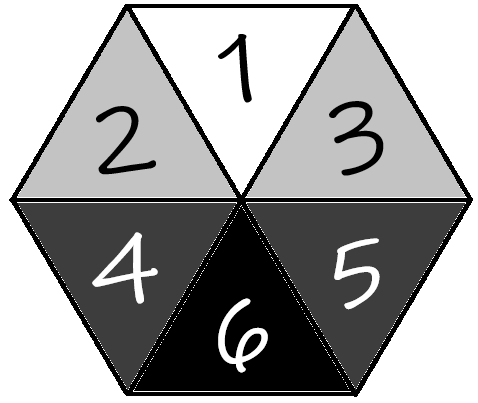

# 🌊 Sistema de Navegação pelos Mares

## 1. Definir as Funções da Tripulação

### 🧭 Navegador
Responsável por traçar o curso da embarcação e manter o rumo.

- **Ação:** Teste de **SAB** ou **INT** contra a CD do tipo de mar.
- **Sucesso:** Segue o curso planejado sem desvios.
- **Falha:** Rolar `1d3` para determinar a deriva usando o *Oráculo do Navegador*:
  - 1: Manteve o curso
  - 2: Desviou para bombordo
  - 3: Desviou para estibordo
- **Falha grave:** Rolar `1d6` para direção aleatória + `1d6` de dano ao casco.
- **Ausência:** Navegação à deriva (`1d6`).

---

### 👁️ Gajeiro
Vigia do alto do mastro, responsável por avistar perigos e oportunidades no horizonte.

- **Ação:** Teste de **SAB** contra a CD do tipo de mar.
- **Sucesso:** Nota ameaças antes delas se aproximarem do navio.
- **Falha:** O grupo pode ser emboscado.
- **Falha grave:** Emboscada com surpresa + `1d6` de dano ao casco.
- **Ausência:** Não é possível avistar ameaças ou oportunidades antecipadamente.
- **Opcional:** Dado de encontro progressivo  
  `1d10 → 1d8 → 1d6 → 1d4`  
  Ao tirar **1**, ocorre encontro e o dado reinicia.

---

### 🎖️ Imediato
Braço direito do capitão, coordena a tripulação e mantém a moral.

- **Ação:** Teste de **PER** ou **INT** contra a CD do tipo de mar.
- **Sucesso:** Concede vantagem a um membro da tripulação.
- **Falha crítica:** Impõe desvantagem a um membro da tripulação.
- **Ausência:** Sem coordenação adicional.

---

### 🔧 Contramestre
Cuida da integridade da embarcação e realiza reparos durante a viagem.

- **Ação:** Teste de **INT** ou **FOR** contra a CD do tipo de mar.
- **Sucesso:** Realiza `1d6` *reparos improvisados* e mantém o navio em condições.
- **Falha crítica:** Causa `1d6` de avaria ao casco.
- **Ausência:** Sem reparos durante a viagem.

> Reparos improvisados desaparecem quando ...
---

### 🎣 Provedor
Garante alimento e água potável para a tripulação.

- **Ação:** Teste de **SAB** contra a CD do tipo de mar.
- **Sucesso:** Garante recursos para 1 dia de viagem.
- **Falha crítica:** Perda ou contaminação dos suprimentos.
- **Ausência:** Consumo apenas de recursos armazenados.

---

## 2. Definir Tipo de Mar

### 🌍 Tabela de Mar

| d6 | Tipo             | CD | Encontro |
|----|------------------|----|----------|
| 1  | Costa            | 10 | 1d8      |
| 2  | Mar Aberto       | 12 | 1d6      |
| 3  | Traiçoeiro       | 13 | 1d6      |
| 4  | Tempestuoso      | 14 | 1d4      |
| 5  | Congelado        | 13 | 1d8      |
| 6  | Calmaria         | 11 | 1d10     |

---

### ⚠️ Condições do Mar (1d12) - Opcional

1. Ventos Favoráveis → vantagem em todos os testes  
2. Calmaria → +1 HEX de deslocamento  
3. Corrente Forte → usa `1d3` no *Oráculo do Navegador* mesmo com sucesso no teste
4. Névoa → +2 CD em todas as funções  
5. Tempestade → desvantagem em todos os testes + `1d6` dano ao casco  
6. Mar Revolto → `1d6` dano ao casco por HEX  
7. Pirataria → Aumenta chance de encontros 
8. Rotas Comerciais → vantagem em testes do Provedor + chance de encontrar mercadores  
9. Criaturas Marinhas → +1 CD + testa encontros 2x por HEX  
10. Água Escassa → desvantagem nos testes do Provedor  
11. Casco Instável → `2d6` de dano ao casco  
12. Zona Misteriosa → eventos sobrenaturais  

---

## 3. Deslocamento Naval

| Tipo              | HEX/dia | Efeito                           |
|-------------------|---------|----------------------------------|
| Lento e cauteloso | 2       | Vantagem em testes               |
| Normal            | 3       | Padrão                           |
| Rápido            | 4       | Desvantagem em testes            |
| Forçado           | 5       | Desvantagem + risco de avaria    |

---

## 4. Realize os testes de funções da tripulação por HEX diário na seguinte ordem:

1. Navegador  
2. Gajeiro
3. Provedor
4. Contramestre  

⚠️ Imediato a qualquer momento que for necessário

---

## 5. Integridade do Navio

O navio possui **Pontos de Casco** que representam sua resistência estrutural.

- Perde pontos de casco quando:
  - Tempestades ou mar revolto
  - Falhas graves nos testes da tripulação (menos Provedor e Imediato)
  - Combate naval
- **0 pontos de casco → o navio afunda.**

---

| Tipo de Embarcação | Pontos de Casco | Exemplos                                |
|--------------------|-----------------|-----------------------------------------|
| Pequena            | 2d6 + 4         | Bote, jangada, canoa, pequeno veleiro   |
| Média              | 4d6 + 8         | Caravela, escuna, navio mercante pequeno|
| Grande             | 6d6 + 12        | Galeão, navio militar, cargueiro pesado |

---

Sempre que achar necessário, role 1d8 para definir o tipo de avaria:

1. Vela rasgada → -1 HEX/dia
2. Leme danificado → Navegação com desvantagem
3. Vazamento → perde `1d3` pontos de casco por HEX até controle do vazamento
4. Mastro comprometido → impossível usar deslocamento rápido
5. Dispensa alagada → tripulação perde seus recursos
6. Tripulação ferida → desvantagem no Imediato
7. Estrutura instável → dano dobrado
8. Incêndio → perde `1d3` pontos de casco por HEX até controle do incêndio

> Obs.: Dependendo do tipo de embarcação, nem todas as possibilidades acima irão fazer sentido, portanto, use essa tabela para te inspirar a criar novas situações.

---

## 6. Eventos Marítimos (sem encontros no dia)

Quando não há encontro no dia, rolar `1d6`:

1. Destroços → itens à deriva  
2. Ilha distante → possível exploração  
3. Sinal de navio → amigo ou inimigo?  
4. Mudança climática → rolar nova condição do mar  
5. Criatura observando → tensão sem combate  
6. Nada  

---

## 7. Repetição

- Passos **2 e 6** → por dia  
- Passo **4** → por HEX  
- Ajustar integridade do navio quando necessário  
