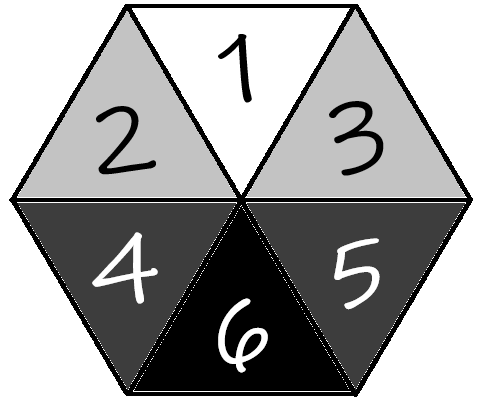

# 🧭 Sistema de Navegação pelos Ermos

## 1. Definir as Funções de Cada Jogador

### 🥾 Batedor
Responsável por avançar à frente do grupo e identificar ameaças.

- **Ação:** Teste de **SAB** ou **AGI** contra a CD do ambiente a cada HEX.
- **Sucesso:** Nota ameaças antes delas perceberem o grupo.
- **Ausência:** Não é possível emboscar ou evitar ameaças.
- **Opcional:** Dado de encontro progressivo  
  `1d10 → 1d8 → 1d6 → 1d4`  
  Ao tirar **1**, ocorre encontro e o dado reinicia.

---

### 🌿 Caçador ou Coletor
Garante alimento e água durante a jornada.

- **Ação:** Teste de **SAB** contra CD do ambiente.
- **Sucesso:** Garante recursos para 1 dia.
- **Ausência:** Consumo apenas de recursos próprios.

---

### 🗺️ Cartógrafo
Registra o mapa da região.

- **Ação:** Teste de **INT** contra CD do ambiente.
- **Sucesso:** Área mapeada → vantagem em testes futuros.
- **Extra:** Rolar `1d6`
  - 1–3: Nada
  - 4: Avistamento
  - 5: Vestígios
  - 6: Marcos
  
  Fique livre para usar uma tabela ou definir puramente com improviso os avistamentos, vestígios e marcos.
- **Ausência:** Sem bônus por exploração prévia.

---

### 🧭 Navegador
Define o caminho do grupo.

- **Ação:** Teste de **SAB** ou **INT**
- **Sucesso:** Segue caminho ideal
- **Falha:** Rolar `1d3` usando o *Oraculo do Navegador*:
  - 1: Correto
  - 2: Esquerda
  - 3: Direita
- **3 falhas no dia:**
  1. Continuar → Usar `1d6` direções
  2. Tentar se orientar → permanece no HEX por um período, rola-se dado de encontro 2x
- **Ausência:** Navegação aleatória (`1d6`)

---

### 🤝 Suporte
Auxilia outros membros.

- **Ação:** Concede vantagem a outro personagem.
- **Ausência:** Sem suporte adicional.

---

## 2. Definir Caminhos Possíveis
Estabeleça rotas entre origem e destino.

---

## 3. Definir Tipo de Terreno

### 🌍 Tabela de Terreno

| d8 | Tipo      | CD | Característica         |
|----|----------|----|------------------------|
| 1  | Deserto  | 13 | Baixa visibilidade     |
| 2  | Planície | 10 | Abundante              |
| 3  | Pântano  | 13 | Água poluída           |
| 4  | Colina   | 10 | -                      |
| 5  | Floresta | 12 | -                      |
| 6  | Montanha | 12 | Altitude elevada       |
| 7  | Tundra   | 11 | -                      |
| 8  | Geleira  | 14 | Tempestade de neve     |

---

### ⚠️ Características Extras (1d12)

1. Abundante → Caça automática  
2. Altitude Elevada → desvantagem  
3. Magia Caótica → Toda tentativa de magia pode gerar uma consequência, mesmo que apenas narrativa
4. Água Poluída → envenenamento  
5. Baixa Visibilidade → +2 CD em todas as funções
6. Caminho Confuso → +2 CD Navegação  
7. Campo de Batalha → +1 CD + encontros extras  
8. Estrada de Mercadores → vantagem + caravanas  
9. Gases Venenosos → 1d4 dano por HEX  
10. Suga-vida → cura reduzida  
11. Terreno Acidentado → 1d4 dano por falha  
12. Terreno Infértil → +3 CD Coletor

---

## 4. Deslocamento e Sobrecarga

| Tipo                  | Leve | Médio | Alto | Extremo |
|----------------------|------|------|------|--------|
| Lento e cuidadoso*   | 15 km | 10 km | 5 km | 0 km |
| A pé                 | 25 km | 20 km | 15 km | 5 km |
| Montaria             | 35 km | 30 km | 20 km | 10 km*** |
| Galopando**          | 70 km | 50 km | 30 km | 10 km*** |

- *Vantagem em testes
- **Desvantagem em testes
- ***Teste de desmaio da montaria (1d6)

---

## 5. Tempo Médio da Viagem
Baseado nos passos 2 e 4.

---

## 6. Hora de Partida (Opcional)
Rolar `1d12`.

---

## 7. Clima (Flor do Tempo)

A partir do HEX `azul` na Flor do Tempo (ponto de partida), defina o tipo de região (neutra, desértica ou gélida) e role `2d6` para determinar o clima conforme a tabela.

| Cor      | Região Neutra              | Região Desértica                          | Região Gélida              |
|----------|----------------------------|-------------------------------------------|----------------------------|
| Azul     | Ponto de partida (neutro)  | Ponto de partida (neutro)                 | Ponto de partida (neutro)  |
| Amarelo  | Sol entre núvens           | Calor suportável                          | Frio moderado              |
| Roxo     | Chuvoso ou Tempestade(!)   | Calor intenso ou Inferno na Terra(!)      | Frio ou Frio intenso(!)    |
| Verde    | Calor ou Calor Intenso(!)  | Noite fria ou Noite fria Intensa(!)       | Nevando ou Nevasca(!)      |
| Laranja  | Tempestade com ventania    | Tempestade de areia                       | Tempestade de gelo         |
| Vermelho | Furacão                    | Chuva de fogo                             | Avalanche                  |

> Fique livre para determinar o que ocorre com o grupo a cada tipo de clima.
---

## 8. Realize os testes de funções do grupo por HEX na seguinte ordem:

1. Navegador  
2. Cartógrafo  
3. Batedor  
4. Caçador/Coletor  

⚠️ Suporte a qualquer momento que for necessário

---

## 9. Acampamento

### 👁️ Vigia
Função apenas em acampamentos.
- Recupera apenas `1d3`
- Grupo recupera `1d6`
- **Ação:** Teste de SAB ou INT para notar perigos
- **Falha:** Grupo pode ser surpreendido

---

## 10. Repetição

- Passos **7 e 9** → por dia  
- Passo **8** → por HEX  
- Ajustar sobrecarga quando necessário  

---

# 🌊 Sistema de Navegação Marítima

## 1. Definir as Funções da Tripulação

### 🧭 Navegador
Responsável por traçar o curso da embarcação e manter o rumo.

- **Ação:** Teste de **SAB** ou **INT** contra a CD do tipo de mar.
- **Sucesso:** Segue o curso planejado sem desvios.
- **Falha:** Rolar `1d3` para determinar a deriva usando o *Oráculo do Navegador*:
  - 1: Manteve o curso
  - 2: Desviou para bombordo
  - 3: Desviou para estibordo
- **Falha grave:** Rolar `1d6` para direção aleatória + `1d6` de dano ao casco.
- **Ausência:** Navegação à deriva (`1d6`).

---

### 👁️ Gajeiro
Vigia do alto do mastro, responsável por avistar perigos e oportunidades no horizonte.

- **Ação:** Teste de **SAB** contra a CD do tipo de mar.
- **Sucesso:** Nota ameaças antes delas se aproximarem do navio.
- **Falha:** O grupo pode ser emboscado.
- **Falha grave:** Emboscada com surpresa + `1d6` de dano ao casco.
- **Ausência:** Não é possível avistar ameaças ou oportunidades antecipadamente.
- **Opcional:** Dado de encontro progressivo  
  `1d10 → 1d8 → 1d6 → 1d4`  
  Ao tirar **1**, ocorre encontro e o dado reinicia.

---

### 🎖️ Imediato
Braço direito do capitão, coordena a tripulação e mantém a moral.

- **Ação:** Teste de **PER** ou **INT** contra a CD do tipo de mar.
- **Sucesso:** Concede vantagem a um membro da tripulação.
- **Falha crítica:** Impõe desvantagem a um membro da tripulação.
- **Ausência:** Sem coordenação adicional.

---

### 🔧 Contramestre
Cuida da integridade da embarcação e realiza reparos durante a viagem.

- **Ação:** Teste de **INT** ou **FOR** contra a CD do tipo de mar.
- **Sucesso:** Realiza `1d6` *reparos improvisados* e mantém o navio em condições.
- **Falha crítica:** Causa `1d6` de avaria ao casco.
- **Ausência:** Sem reparos durante a viagem.

> Reparos improvisados desaparecem quando ...
---

### 🎣 Provedor
Garante alimento e água potável para a tripulação.

- **Ação:** Teste de **SAB** contra a CD do tipo de mar.
- **Sucesso:** Garante recursos para 1 dia de viagem.
- **Falha crítica:** Perda ou contaminação dos suprimentos.
- **Ausência:** Consumo apenas de recursos armazenados.

---

## 2. Definir Tipo de Mar

### 🌍 Tabela de Mar

| d6 | Tipo             | CD | Encontro |
|----|------------------|----|----------|
| 1  | Costa            | 10 | 1d8      |
| 2  | Mar Aberto       | 12 | 1d6      |
| 3  | Traiçoeiro       | 13 | 1d6      |
| 4  | Tempestuoso      | 14 | 1d4      |
| 5  | Congelado        | 13 | 1d8      |
| 6  | Calmaria         | 11 | 1d10     |

---

### ⚠️ Condições do Mar (1d12) - Opcional

1. Ventos Favoráveis → vantagem em todos os testes  
2. Calmaria → +1 HEX de deslocamento  
3. Corrente Forte → usa `1d3` no *Oráculo do Navegador* mesmo com sucesso no teste
4. Névoa → +2 CD em todas as funções  
5. Tempestade → desvantagem em todos os testes + `1d6` dano ao casco  
6. Mar Revolto → `1d6` dano ao casco por HEX  
7. Pirataria → Aumenta chance de encontros 
8. Rotas Comerciais → vantagem em testes do Provedor + chance de encontrar mercadores  
9. Criaturas Marinhas → +1 CD + testa encontros 2x por HEX  
10. Água Escassa → desvantagem nos testes do Provedor  
11. Casco Instável → `2d6` de dano ao casco  
12. Zona Misteriosa → eventos sobrenaturais  

---

## 3. Deslocamento Naval

| Tipo              | HEX/dia | Efeito                           |
|-------------------|---------|----------------------------------|
| Lento e cauteloso | 2       | Vantagem em testes               |
| Normal            | 3       | Padrão                           |
| Rápido            | 4       | Desvantagem em testes            |
| Forçado           | 5       | Desvantagem + risco de avaria    |

---

## 4. Realize os testes de funções da tripulação por HEX diário na seguinte ordem:

1. Navegador  
2. Gajeiro
3. Provedor
4. Contramestre  

⚠️ Imediato a qualquer momento que for necessário

---

## 5. Integridade do Navio

O navio possui **Pontos de Casco** que representam sua resistência estrutural.

- Perde pontos de casco quando:
  - Tempestades ou mar revolto
  - Falhas graves nos testes da tripulação (menos Provedor e Imediato)
  - Combate naval
- **0 pontos de casco → o navio afunda.**

---

| Tipo de Embarcação | Pontos de Casco | Exemplos                                |
|--------------------|-----------------|-----------------------------------------|
| Pequena            | 2d6 + 4         | Bote, jangada, canoa, pequeno veleiro   |
| Média              | 4d6 + 8         | Caravela, escuna, navio mercante pequeno|
| Grande             | 6d6 + 12        | Galeão, navio militar, cargueiro pesado |

---

Sempre que achar necessário, role 1d8 para definir o tipo de avaria:

1. Vela rasgada → -1 HEX/dia
2. Leme danificado → Navegação com desvantagem
3. Vazamento → perde `1d3` pontos de casco por HEX até controle do vazamento
4. Mastro comprometido → impossível usar deslocamento rápido
5. Dispensa alagada → tripulação perde seus recursos
6. Tripulação ferida → desvantagem no Imediato
7. Estrutura instável → dano dobrado
8. Incêndio → perde `1d3` pontos de casco por HEX até controle do incêndio

---

## 6. Eventos Marítimos (sem encontros no dia)

Quando não há encontro no dia, rolar `1d6`:

1. Destroços → itens à deriva  
2. Ilha distante → possível exploração  
3. Sinal de navio → amigo ou inimigo?  
4. Mudança climática → rolar nova condição do mar  
5. Criatura observando → tensão sem combate  
6. Nada  

---

## 7. Repetição

- Passos **2 e 6** → por dia  
- Passo **4** → por HEX  
- Ajustar integridade do navio quando necessário  
